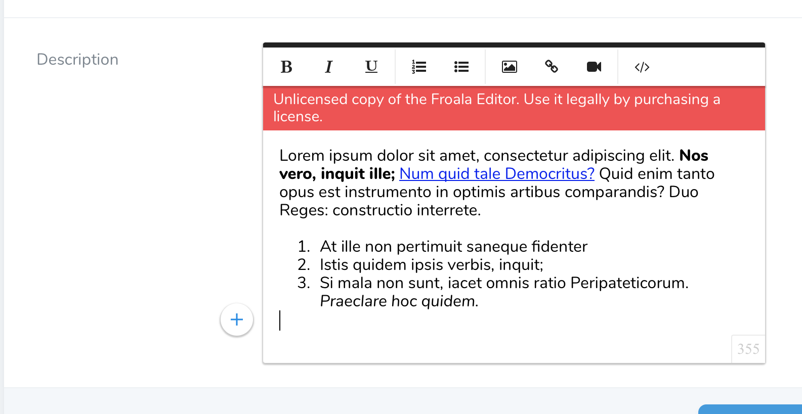

# Nova Froala editor field
Laravel Nova Froala Editor field.

## Installation

1. You can install the package in to a Laravel app that uses Nova via composer:

```
composer require alfonsobries/nova-froala-editor
```

2. The froala editor needs to load the font awesome library, in order to publish the fonts in the public folder you need to run:

```
php artisan vendor:publish --tag=froala-editor-fonts
```

## Simple Usage:
```php
NovaFroalaEditor::make('Field Name')
```

## Advanced Usage:
You can pass any existing Froala option. Consult the [Froala documentation](https://www.froala.com/wysiwyg-editor/docs/options) to view the list of all the available options
```php
NovaFroalaEditor::make('Description')
    ->options(['toolbarInline' => true])
```

## Screenshot


## License
The MIT License (MIT). Please see [License File](LICENSE) for more information.
